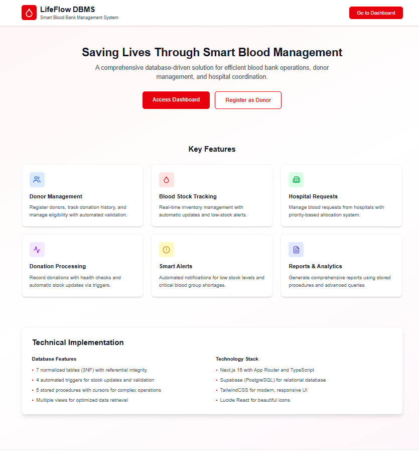
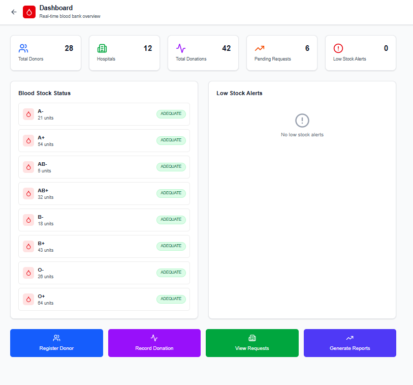
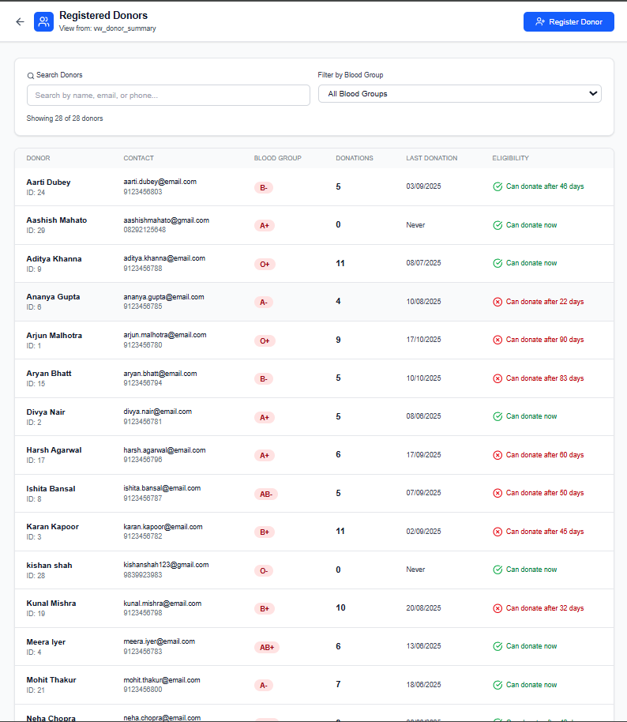
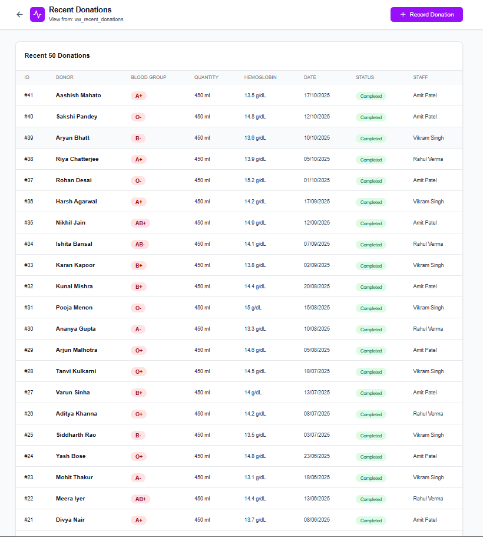
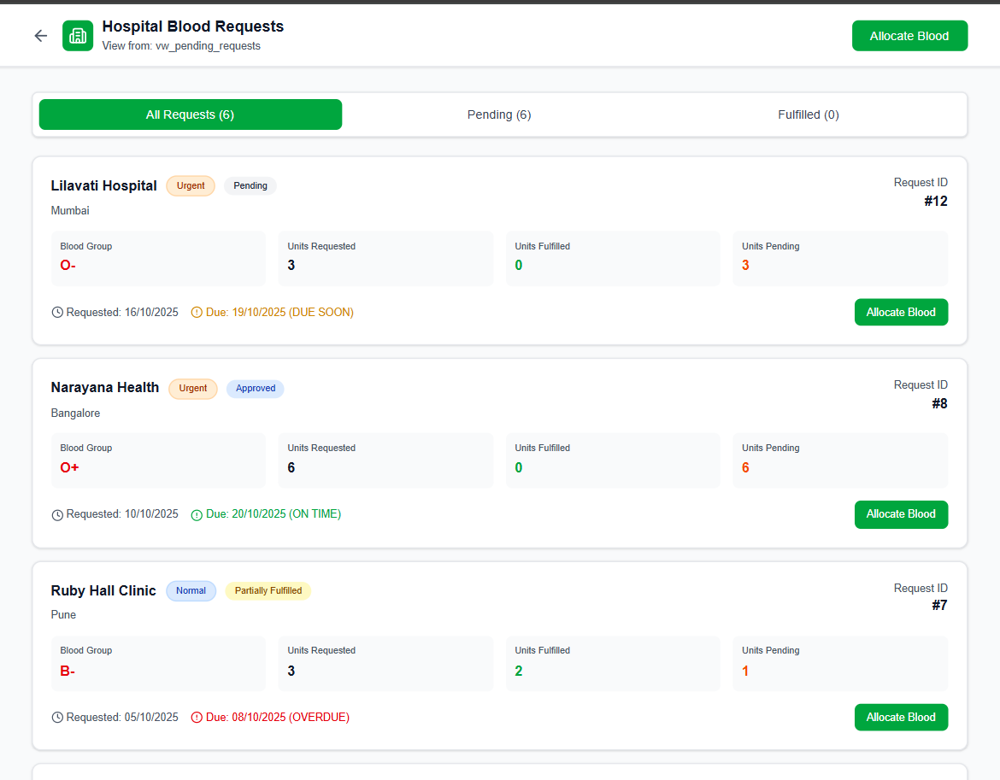
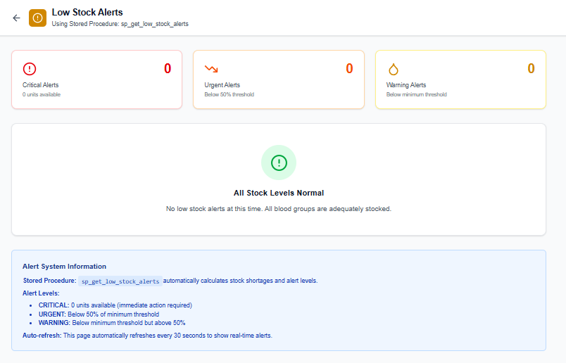

# 🩸 LifeFlow DBMS

A comprehensive blood bank management system built with Next.js, TypeScript, and PostgreSQL (Supabase).

[]()
[]()
[]()

---

## ⚡ Quick Start

```bash
# Clone the repository
git clone https://github.com/yourusername/lifeflow-dbms.git
cd lifeflow-dbms

# Install dependencies
npm install

# Set up environment variables
cp env.example .env.local
# Add your Supabase credentials to .env.local

# Set up database
# 1. Create a Supabase project at supabase.com
# 2. Run database/schema.sql in Supabase SQL Editor
# 3. Run database/seed_data.sql for sample data

# Start development server
npm run dev

# Open http://localhost:3000
```

---

## 🎯 Features

- **Donor Management** - Register donors, track donation history, automated eligibility checks
- **Blood Stock Tracking** - Real-time inventory with automatic updates via triggers
- **Hospital Requests** - Priority-based blood allocation system
- **Donation Processing** - Health parameter validation and stock updates
- **Smart Alerts** - Automated low stock notifications
- **Reports & Analytics** - Monthly donation reports with stored procedures

---

## 📋 Database Schema

### Tables
- **Staff** (8 records) - Blood bank employees
- **Donors** (25 records) - Registered donors with eligibility tracking
- **Hospitals** (12 records) - Registered hospitals
- **BloodStock** (8 records) - Real-time inventory for all blood groups
- **Donations** (40 records) - Complete donation history
- **Requests** (12 records) - Hospital blood requests
- **Transfusions** (8 records) - Blood allocation records

### Database Features
- **5 Stored Procedures** with cursors for complex operations
- **4 Triggers** for automatic data integrity
- **4 Views** for optimized queries
- **3NF Normalization** with proper foreign key constraints

---

## 📦 Installation

### Prerequisites
- Node.js 18+
- Supabase account (free tier works)

### Setup Steps

1. **Install dependencies**
   ```bash
   npm install
   ```

2. **Set up Supabase**
   - Create a project at [supabase.com](https://supabase.com)
   - Run `database/schema.sql` in SQL Editor
   - Run `database/seed_data.sql` for sample data

3. **Configure environment**
   ```bash
   cp env.example .env.local
   ```
   Add your Supabase URL and anon key to `.env.local`

4. **Start development server**
   ```bash
   npm run dev
   ```

---

## 📁 Project Structure

```
lifeflow-dbms/
├── app/                    # Next.js pages
│   ├── dashboard/         # Main dashboard
│   ├── donors/            # Donor management
│   ├── donations/         # Donation processing
│   ├── requests/          # Hospital requests
│   ├── stock/             # Blood inventory
│   ├── alerts/            # Low stock alerts
│   └── reports/           # Monthly reports
├── database/
│   ├── schema.sql         # Database schema
│   └── seed_data.sql      # Sample data
├── lib/
│   └── supabase.ts        # Database client
└── .env.local             # Environment variables
```

---

## 📸 Screenshots

### Homepage


### Dashboard


### Donor Registration


### Process Donation


### Blood Allocation


### Low Stock Alerts


### Database Tables


---

## 🚀 Tech Stack

- **Frontend:** Next.js 15, TypeScript, TailwindCSS
- **Backend:** Supabase (PostgreSQL)
- **Database:** PostgreSQL with PL/pgSQL
- **Features:** 5 Stored Procedures, 4 Triggers, 4 Views

---

## 📝 License

This project is licensed under the MIT License - see below for details.

**MIT License**

Copyright (c) 2025 Aashish Mahato

Permission is hereby granted, free of charge, to any person obtaining a copy of this software and associated documentation files (the "Software"), to deal in the Software without restriction, including without limitation the rights to use, copy, modify, merge, publish, distribute, sublicense, and/or sell copies of the Software, and to permit persons to whom the Software is furnished to do so, subject to the following conditions:

The above copyright notice and this permission notice shall be included in all copies or substantial portions of the Software.

THE SOFTWARE IS PROVIDED "AS IS", WITHOUT WARRANTY OF ANY KIND, EXPRESS OR IMPLIED, INCLUDING BUT NOT LIMITED TO THE WARRANTIES OF MERCHANTABILITY, FITNESS FOR A PARTICULAR PURPOSE AND NONINFRINGEMENT. IN NO EVENT SHALL THE AUTHORS OR COPYRIGHT HOLDERS BE LIABLE FOR ANY CLAIM, DAMAGES OR OTHER LIABILITY, WHETHER IN AN ACTION OF CONTRACT, TORT OR OTHERWISE, ARISING FROM, OUT OF OR IN CONNECTION WITH THE SOFTWARE OR THE USE OR OTHER DEALINGS IN THE SOFTWARE.

---

**Note:** This project was created for educational purposes as part of a Database Management Systems course.

---

## 🤝 Contributing

Contributions, issues, and feature requests are welcome!

---

**Built for efficient blood bank management** 🩸
